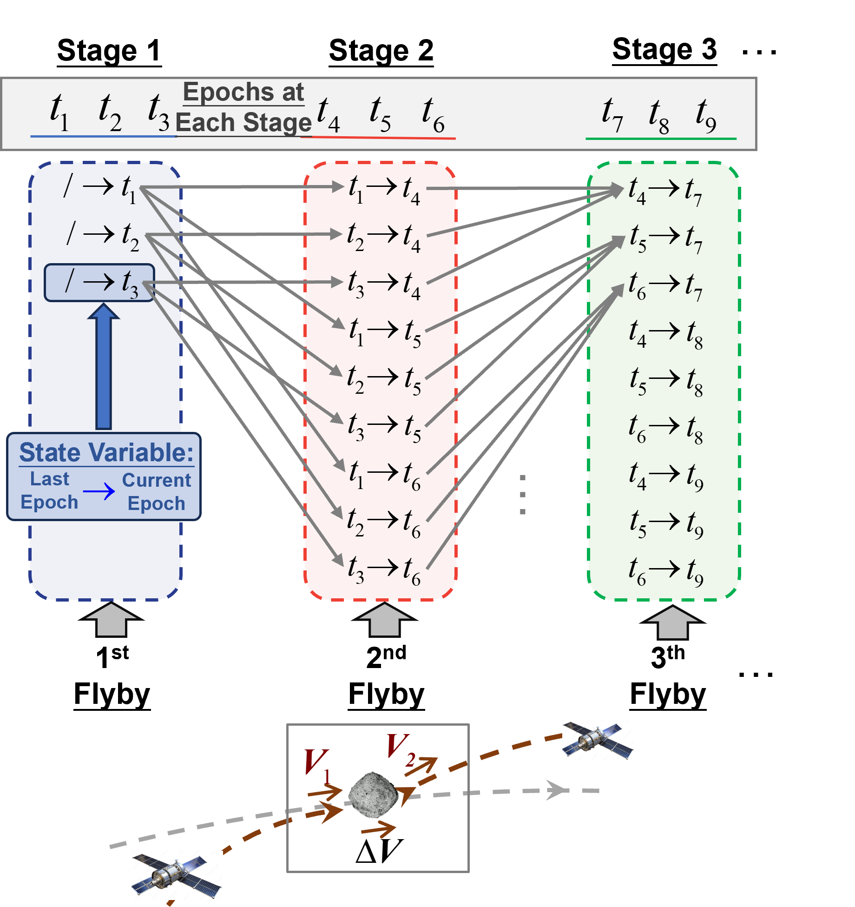

## Multi-Flyby Dynamic Programming

### Overview

This repository showcases the implementation of the Multi-Flyby Bi-Impulse Dynamic Programming algorithm. Bi-impulse refers to maneuvers where impulses are applied only at flyby moments without intermediate thrusting.

In this scenario, a two-dimensional state vector is sufficient to describe the spacecraft¡¯s state. The algorithm¡¯s complexity is limited to $(O(N_s^2 \times N)$, where $N_s$ is the number of states per stage, and $N$ is the number of flybys. For more general cases, such as Multi-Flyby Low-Thrust optimization, the implementation requires more complex code and dependencies. You are welcome to contact the author, Zhong Zhang, at [zhongzhang.astro@gmail.com](mailto:zhongzhang.astro@gmail.com) for further discussion.

If you use this code or parts of it in a scientific publication, we would greatly appreciate a citation either to this repository or the related publications listed below.

### Algorithm Illustration



---

## Papers Based on Multi-Flyby Global Optimality

- **[Global Optimality in Multi-Flyby Asteroid Trajectory Optimization: Theory and Application Techniques]** - *Journal of Guidance, Control, and Dynamics*, 2024 (Submitted)

- **[Global Trajectory Optimization of Multi-Spacecraft Successive Rendezvous Using Multi-Tree Search](https://arc.aiaa.org/doi/10.2514/1.G007764)** - *Journal of Guidance, Control, and Dynamics*, 2024

---

## Getting Started

### Prerequisites

To get started, ensure that you have the required dependencies and tools for compiling and running the project. Once compiled, the program will generate results for impulsive GTOC4 and GTOC11 problems.

### Document Structure

- **`code/bin`**: Contains compiled binaries and output files.
- **`code/include`**: Includes basic astrodynamics utilities and other dependencies.
- **`code/input`**: Provides the initial orbital elements for all asteroids involved in GTOC4 and GTOC11 problems.
- **`code/src`**: Contains the core implementation.
- **`result_solution`**: Stores the results for impulsive GTOC4, GTOC11, and original low-thrust GTOC4 problems.

### Installation

#### Linux
```bash
# Clone the repository
git clone --recursive https://github.com/zhong-zh15/Multi_Flyby_Dynamic_Programming

# Create build directory
cd code && mkdir build

# Build the project
cd build && rm -rf *
cmake ..
make
```

#### Windows (Visual Studio 2022)
```bash
# Clone the repository
git clone --recursive https://github.com/zhong-zh15/Multi_Flyby_Dynamic_Programming
```

---

## Authors

- **Zhong Zhang** - *Initial Implementation* - [Zhong Zhang, Tsinghua, LAD](https://github.com/zhong-zh15)

---

## License

This project is licensed under the MIT License - see the [LICENSE](LICENSE) file for details.
